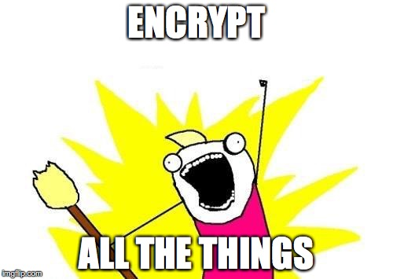
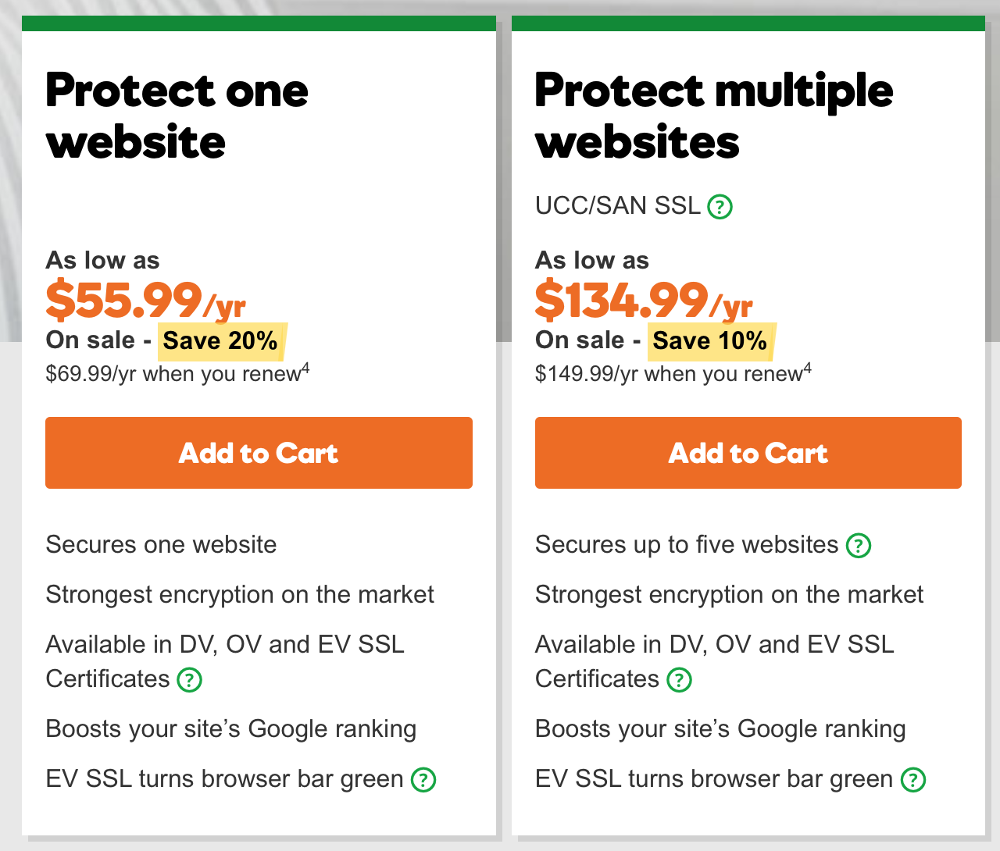
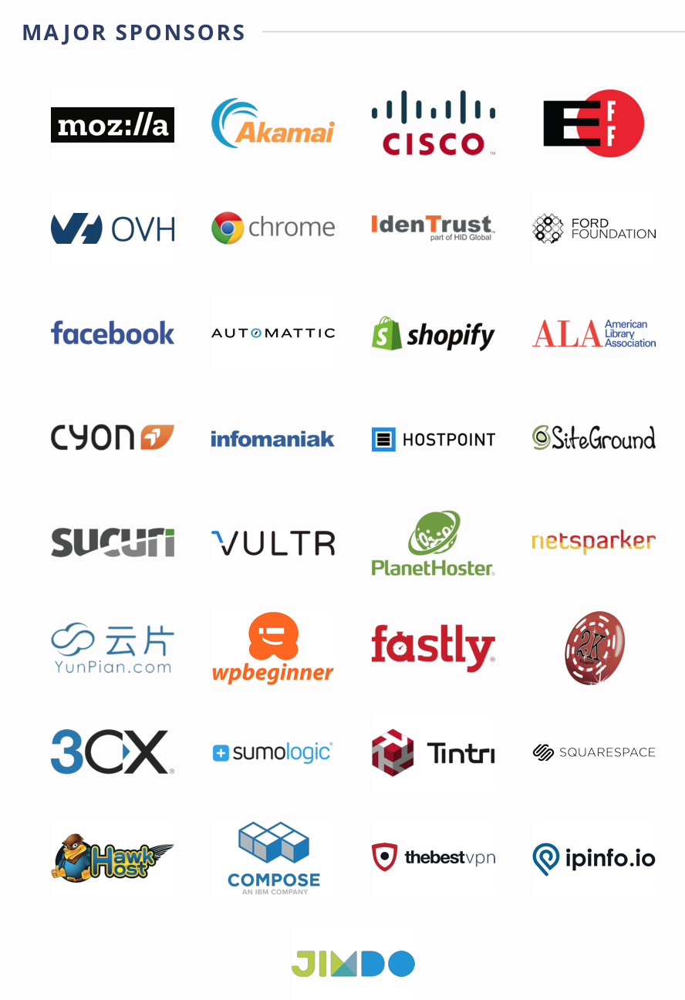

build-lists: true
autoscale: true

# Let's encrypt

#### twin ports web pros
#### eric watson
#### april 2017

---

---

# Why encrypt?

---

# Benefits of TLS

- guarantees content integrity
- prevents eavesdropping
- prevents man-in-the-middle attacks
- prevents replay attacks
- improved search engine rankings

---

# The old way

---

---

# Problems

- cost: $60/year and up
- certificates expire
- process is manual and error-prone

---

# Annual manual steps

1. Generate a Certificate Signing Request (CSR)
2. Cut and paste your CSR into the certificate authority (CA) web page
3. Prove ownership of your domain by publishing the CA's "challenge"
4. Download the new certificate and install it on the web server

---

# The insight

> If we make this easier, more people will do it

---

# Let's encrypt

---

# How it works

## Automate the manual steps

- [ACME](https://ietf-wg-acme.github.io/acme/) (Automatic Certificate Management Environment)
- Many [clients available](https://letsencrypt.org/docs/client-options/) besides default

---

# HTTP/2 is coming

## and it's https:// only

---

# Set up let's encrypt

1. Fire up a web server
2. Expose the ACME endpoint
3. Install let's encrypt agent (`certbot`)
4. Issue/install a certificate
5. Add certificate/key to web server config
6. Redirect http to https (optional)
7. Schedule automatic renewal (optional)

---

# Demo

---

# Thank you!

---

# Resources

ACME

- https://ietf-wg-acme.github.io/acme/
- https://letsencrypt.org/docs/client-options/

Certbot

- https://certbot.eff.org
- https://www.digitalocean.com/community/tutorials/how-to-secure-nginx-with-let-s-encrypt-on-ubuntu-16-04

SEO

- https://support.google.com/webmasters/answer/6073543?hl=en

